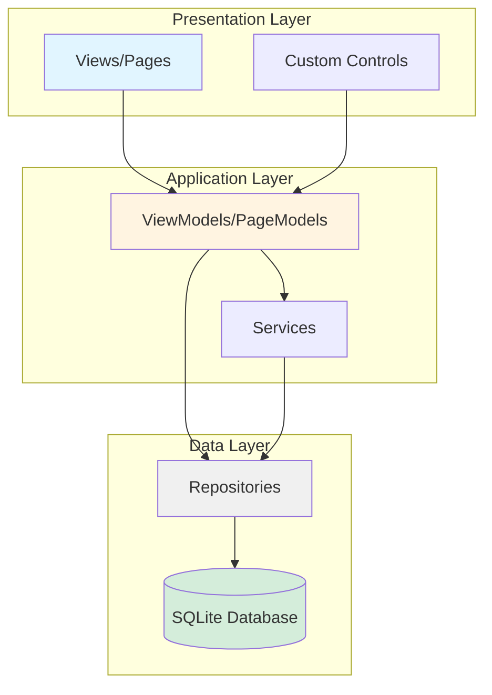
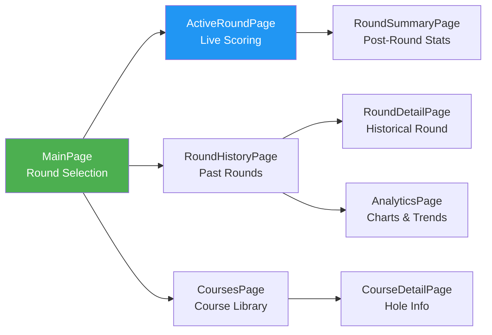
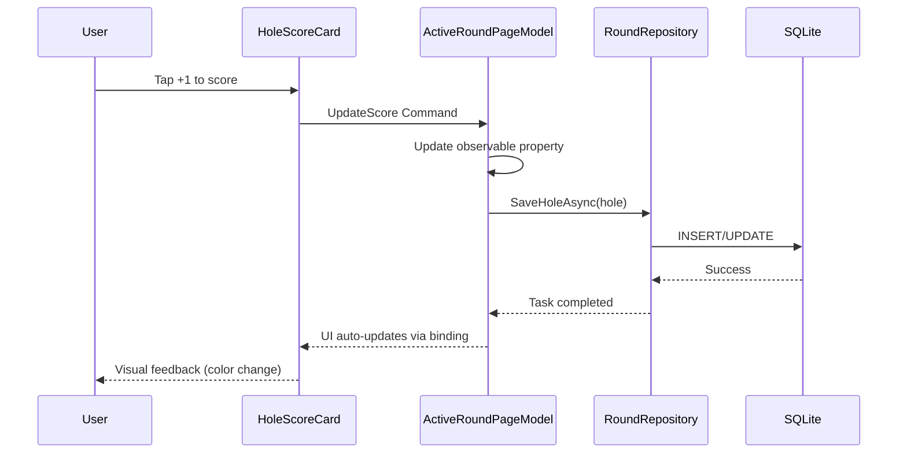

# Architecture Overview

## High-Level Architecture

The Golf Scoring App follows a clean MVVM (Model-View-ViewModel) architecture with a repository pattern for data access.



## Navigation Flow



## Project Structure

```
iDoublePress/
??? Models/                     # Data models and entities
?   ??? Round.cs               # Golf round model
?   ??? Hole.cs                # Individual hole scoring
?   ??? Course.cs              # Course information
?   ??? Player.cs              # Player profile
?   ??? Stats.cs               # Extended scoring stats
?
??? PageModels/                # ViewModels (MVVM pattern)
?   ??? MainPageModel.cs       # Round selection/dashboard
?   ??? ActiveRoundPageModel.cs
?   ??? RoundHistoryPageModel.cs
?   ??? AnalyticsPageModel.cs
?
??? Pages/                     # Views (XAML + code-behind)
?   ??? MainPage.xaml
?   ??? ActiveRoundPage.xaml
?   ??? RoundHistoryPage.xaml
?   ??? Controls/              # Reusable UI components
?       ??? HoleScoreCard.xaml
?       ??? ScoreChart.xaml
?       ??? RoundSummary.xaml
?
??? Repositories/              # Data access layer
?   ??? RoundRepository.cs
?   ??? CourseRepository.cs
?   ??? PlayerRepository.cs
?
??? Services/                  # Business logic services
?   ??? HandicapCalculator.cs
?   ??? StatsCalculator.cs
?   ??? SeedDataService.cs
?
??? Resources/                 # Assets and styles
?   ??? Styles/
?   ?   ??? AppStyles.xaml    # Fluent Design typography
?   ??? Images/
?   ??? Fonts/
?
??? docs/                      # Project documentation
```

## Key Patterns

### MVVM with CommunityToolkit.Mvvm

All ViewModels inherit from `ObservableObject` and use source generators:

```csharp
public partial class ActiveRoundPageModel : ObservableObject
{
    [ObservableProperty]
    private Round? currentRound;

    [RelayCommand]
    private async Task SaveScore(Hole hole)
    {
        await _roundRepository.SaveHoleAsync(hole);
    }
}
```

### Repository Pattern

Data access is abstracted through repositories:

```csharp
public interface IRoundRepository
{
    Task<List<Round>> ListAsync();
    Task<Round?> GetItemAsync(int id);
    Task SaveItemAsync(Round round);
    Task DeleteItemAsync(Round round);
}
```

### Dependency Injection

Services and repositories are registered in `MauiProgram.cs`:

```csharp
// Repositories
builder.Services.AddSingleton<RoundRepository>();
builder.Services.AddSingleton<CourseRepository>();

// Services
builder.Services.AddSingleton<HandicapCalculator>();

// ViewModels
builder.Services.AddSingleton<MainPageModel>();
builder.Services.AddTransientWithShellRoute<ActiveRoundPage, ActiveRoundPageModel>("active-round");
```

## Data Flow

### Scoring a Hole (Typical Flow)



## Database Schema

See [`docs/database-schema.md`](database-schema.md) for detailed schema design.

### Core Tables
- `Rounds` - Golf round metadata
- `Holes` - Individual hole scores
- `Courses` - Course information
- `Players` - Player profiles
- `Stats` - Extended scoring statistics

## UI/UX Architecture

### Design System

Following Microsoft Fluent Design principles:

- **Typography**: Defined in `AppStyles.xaml` (Title1, Title2, Body1, etc.)
- **Spacing**: Responsive with `OnIdiom` for phone vs desktop
- **Colors**: Theme-aware with `AppThemeBinding` for light/dark modes
- **Icons**: Fluent System Icons via font glyphs

### Responsive Design

```xaml
<Label Style="{StaticResource Title2}" 
       FontSize="{OnIdiom Phone=22, Desktop=28}" />

<Thickness x:key="LayoutPadding">
    <OnIdiom Default="15">
        <OnIdiom.Desktop>30</OnIdiom.Desktop>
    </OnIdiom>
</Thickness>
```

### Custom Controls

Reusable components encapsulate complex UI:

- `HoleScoreCard.xaml` - Score entry for a single hole
- `ScoreChart.xaml` - Visual score distribution (reuses CategoryChart pattern)
- `RoundSummary.xaml` - Post-round statistics display

## Platform-Specific Considerations

### iOS
- Respect safe areas
- Use native navigation patterns
- Handle background state for active rounds

### Android
- Material Design guidelines
- Back button handling
- Permissions for GPS (future)

### Windows
- Keyboard navigation support
- Window resizing
- Desktop-optimized layouts

### macOS
- Mac Catalyst considerations
- Menu bar integration potential

## Performance Strategies

1. **Database Optimization**
   - Indexes on frequently queried columns
   - Lazy loading for large datasets
   - Pagination in history views

2. **UI Performance**
   - Virtualization for long lists (CollectionView)
   - Async loading with loading indicators
   - Image caching and optimization

3. **Memory Management**
   - Dispose resources properly
   - Weak event handlers where appropriate
   - Profile with Visual Studio performance tools

## Error Handling

Centralized error handling through `ModalErrorHandler`:

```csharp
try
{
    await _roundRepository.SaveItemAsync(round);
}
catch (Exception ex)
{
    _errorHandler.HandleError(ex);
}
```

## Testing Strategy

### Unit Tests
- Repository logic
- ViewModel command logic
- Business calculations (handicap, stats)

### Integration Tests
- Database operations
- Service interactions

### UI Tests
- Critical user flows (score entry, round completion)
- Platform-specific testing

## Future Considerations

- **Cloud Sync**: Azure Mobile Apps or custom API
- **Offline Conflict Resolution**: Last-write-wins initially
- **Analytics**: Application Insights integration
- **Crash Reporting**: App Center or similar

---

**Related Documentation**:
- [Development Plan](development-plan.md)
- [Database Schema](database-schema.md)
- [Feature Specifications](features/)
