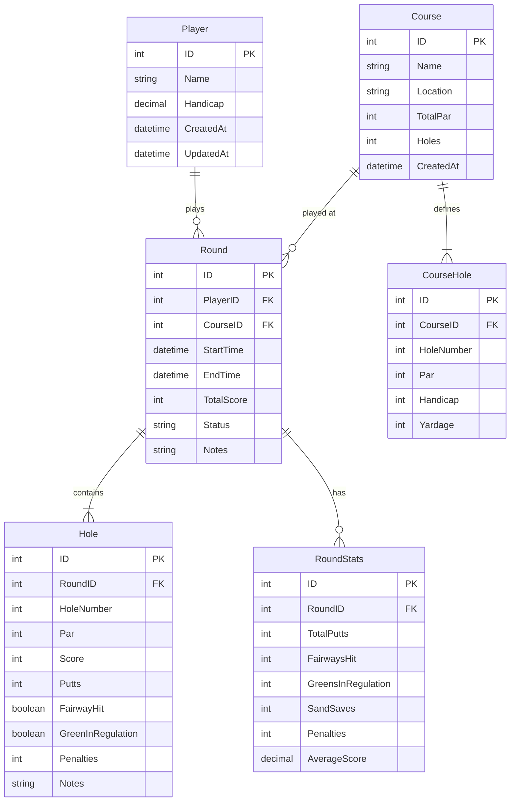

# Database Schema

## Overview

The Golf Scoring App uses SQLite for local data storage, following the repository pattern established in the codebase.

## Entity Relationship Diagram



## Table Definitions

### Player Table
```sql
CREATE TABLE Player (
    ID INTEGER PRIMARY KEY AUTOINCREMENT,
    Name NVARCHAR(100) NOT NULL,
    Handicap DECIMAL(4,1) DEFAULT 0,
    Email NVARCHAR(100),
    CreatedAt DATETIME DEFAULT CURRENT_TIMESTAMP,
    UpdatedAt DATETIME DEFAULT CURRENT_TIMESTAMP
);

CREATE INDEX IDX_Player_Name ON Player(Name);
```

### Course Table
```sql
CREATE TABLE Course (
    ID INTEGER PRIMARY KEY AUTOINCREMENT,
    Name NVARCHAR(200) NOT NULL,
    Location NVARCHAR(200),
    TotalPar INTEGER NOT NULL,
    Holes INTEGER DEFAULT 18,
    Rating DECIMAL(3,1),
    Slope INTEGER,
    CreatedAt DATETIME DEFAULT CURRENT_TIMESTAMP,
    IsCustom BOOLEAN DEFAULT 0
);

CREATE INDEX IDX_Course_Name ON Course(Name);
```

### CourseHole Table
```sql
CREATE TABLE CourseHole (
    ID INTEGER PRIMARY KEY AUTOINCREMENT,
    CourseID INTEGER NOT NULL,
    HoleNumber INTEGER NOT NULL,
    Par INTEGER NOT NULL,
    Handicap INTEGER,
    Yardage INTEGER,
    FOREIGN KEY (CourseID) REFERENCES Course(ID) ON DELETE CASCADE,
    UNIQUE(CourseID, HoleNumber)
);

CREATE INDEX IDX_CourseHole_CourseID ON CourseHole(CourseID);
```

### Round Table
```sql
CREATE TABLE Round (
    ID INTEGER PRIMARY KEY AUTOINCREMENT,
    PlayerID INTEGER NOT NULL,
    CourseID INTEGER NOT NULL,
    StartTime DATETIME NOT NULL,
    EndTime DATETIME,
    TotalScore INTEGER,
    Status NVARCHAR(20) DEFAULT 'InProgress', -- InProgress, Completed, Abandoned
    Notes NVARCHAR(500),
    Weather NVARCHAR(100),
    CreatedAt DATETIME DEFAULT CURRENT_TIMESTAMP,
    UpdatedAt DATETIME DEFAULT CURRENT_TIMESTAMP,
    FOREIGN KEY (PlayerID) REFERENCES Player(ID) ON DELETE CASCADE,
    FOREIGN KEY (CourseID) REFERENCES Course(ID) ON DELETE RESTRICT
);

CREATE INDEX IDX_Round_PlayerID ON Round(PlayerID);
CREATE INDEX IDX_Round_CourseID ON Round(CourseID);
CREATE INDEX IDX_Round_StartTime ON Round(StartTime DESC);
CREATE INDEX IDX_Round_Status ON Round(Status);
```

### Hole Table
```sql
CREATE TABLE Hole (
    ID INTEGER PRIMARY KEY AUTOINCREMENT,
    RoundID INTEGER NOT NULL,
    HoleNumber INTEGER NOT NULL,
    Par INTEGER NOT NULL,
    Score INTEGER,
    Putts INTEGER DEFAULT 0,
    FairwayHit BOOLEAN,
    GreenInRegulation BOOLEAN,
    Penalties INTEGER DEFAULT 0,
    Notes NVARCHAR(200),
    CreatedAt DATETIME DEFAULT CURRENT_TIMESTAMP,
    UpdatedAt DATETIME DEFAULT CURRENT_TIMESTAMP,
    FOREIGN KEY (RoundID) REFERENCES Round(ID) ON DELETE CASCADE,
    UNIQUE(RoundID, HoleNumber)
);

CREATE INDEX IDX_Hole_RoundID ON Hole(RoundID);
```

### RoundStats Table (Phase 2)
```sql
CREATE TABLE RoundStats (
    ID INTEGER PRIMARY KEY AUTOINCREMENT,
    RoundID INTEGER NOT NULL UNIQUE,
    TotalPutts INTEGER DEFAULT 0,
    FairwaysHit INTEGER DEFAULT 0,
    FairwaysAttempted INTEGER DEFAULT 0,
    GreensInRegulation INTEGER DEFAULT 0,
    SandSaves INTEGER DEFAULT 0,
    SandAttempts INTEGER DEFAULT 0,
    TotalPenalties INTEGER DEFAULT 0,
    AverageScore DECIMAL(4,2),
    Front9Score INTEGER,
    Back9Score INTEGER,
    FOREIGN KEY (RoundID) REFERENCES Round(ID) ON DELETE CASCADE
);

CREATE INDEX IDX_RoundStats_RoundID ON RoundStats(RoundID);
```

## Model Classes

### Round.cs
```csharp
public class Round
{
    public int ID { get; set; }
    public int PlayerID { get; set; }
    public int CourseID { get; set; }
    public DateTime StartTime { get; set; }
    public DateTime? EndTime { get; set; }
    public int TotalScore { get; set; }
    public RoundStatus Status { get; set; }
    public string? Notes { get; set; }
    public string? Weather { get; set; }
    
    // Navigation properties
    public Player? Player { get; set; }
    public Course? Course { get; set; }
    public List<Hole> Holes { get; set; } = new();
    public RoundStats? Stats { get; set; }
    
    // Calculated properties
    public int ScoreRelativeToPar => TotalScore - (Course?.TotalPar ?? 0);
    public TimeSpan Duration => (EndTime ?? DateTime.Now) - StartTime;
}

public enum RoundStatus
{
    InProgress,
    Completed,
    Abandoned
}
```

### Hole.cs
```csharp
public class Hole
{
    public int ID { get; set; }
    public int RoundID { get; set; }
    public int HoleNumber { get; set; }
    public int Par { get; set; }
    public int Score { get; set; }
    public int Putts { get; set; }
    public bool? FairwayHit { get; set; }
    public bool? GreenInRegulation { get; set; }
    public int Penalties { get; set; }
    public string? Notes { get; set; }
    
    // Calculated properties
    public int ScoreRelativeToPar => Score - Par;
    public ScoreType ScoreTypeEnum => CalculateScoreType();
    
    private ScoreType CalculateScoreType()
    {
        var diff = ScoreRelativeToPar;
        return diff switch
        {
            <= -2 => ScoreType.Eagle,
            -1 => ScoreType.Birdie,
            0 => ScoreType.Par,
            1 => ScoreType.Bogey,
            _ => ScoreType.DoubleBogeyOrWorse
        };
    }
}

public enum ScoreType
{
    Eagle,
    Birdie,
    Par,
    Bogey,
    DoubleBogeyOrWorse
}
```

### Course.cs
```csharp
public class Course
{
    public int ID { get; set; }
    public string Name { get; set; } = string.Empty;
    public string? Location { get; set; }
    public int TotalPar { get; set; }
    public int Holes { get; set; } = 18;
    public decimal? Rating { get; set; }
    public int? Slope { get; set; }
    public bool IsCustom { get; set; }
    
    public List<CourseHole> CourseHoles { get; set; } = new();
}

public class CourseHole
{
    public int ID { get; set; }
    public int CourseID { get; set; }
    public int HoleNumber { get; set; }
    public int Par { get; set; }
    public int? Handicap { get; set; }
    public int? Yardage { get; set; }
}
```

### Player.cs
```csharp
public class Player
{
    public int ID { get; set; }
    public string Name { get; set; } = string.Empty;
    public decimal Handicap { get; set; }
    public string? Email { get; set; }
    public DateTime CreatedAt { get; set; }
    public DateTime UpdatedAt { get; set; }
}
```

## Migration Strategy

### Phase 1: Core Tables
1. Create Player, Course, CourseHole tables
2. Create Round and Hole tables
3. Seed with default courses

### Phase 2: Stats Tables
1. Add RoundStats table
2. Backfill stats for existing rounds

### Phase 3: Optimization
1. Add additional indexes based on query patterns
2. Consider partitioning for large datasets (100k+ rounds)

## Data Seeding

Initial seed data should include popular courses:
- Generic 18-hole par 72 course
- Generic 9-hole par 36 course
- Practice round template

See `SeedDataService.cs` for implementation.

## Backup and Recovery

- Auto-backup on app updates
- Export to JSON/CSV capability
- Import from backup file

---

**Related**: [Architecture Overview](architecture.md)
