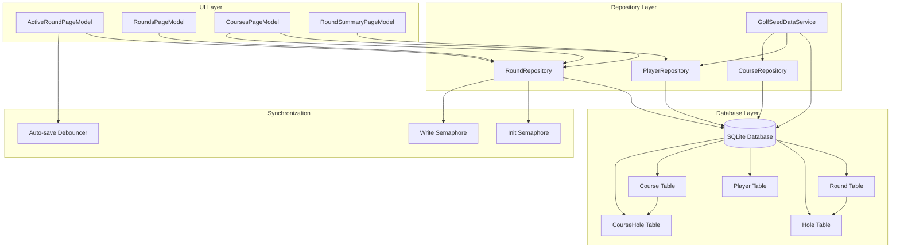
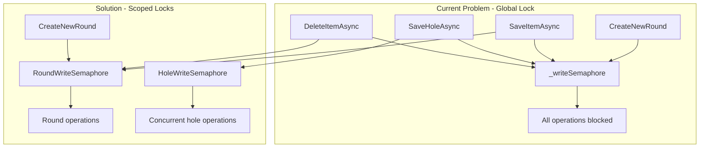
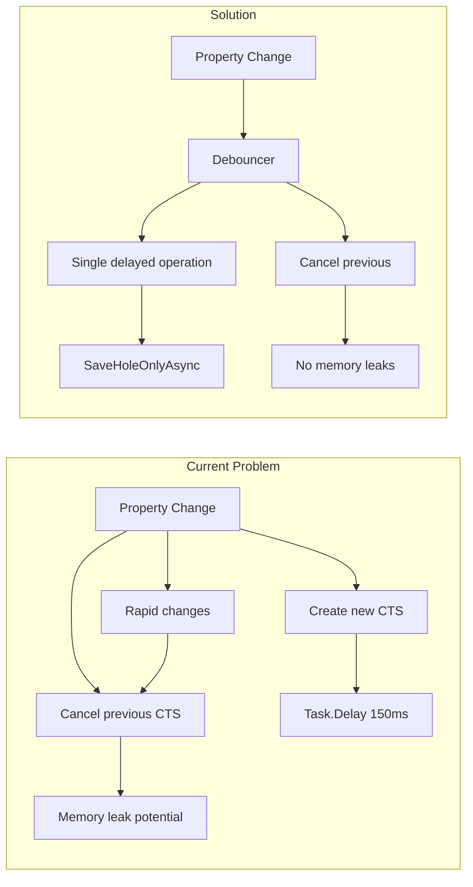
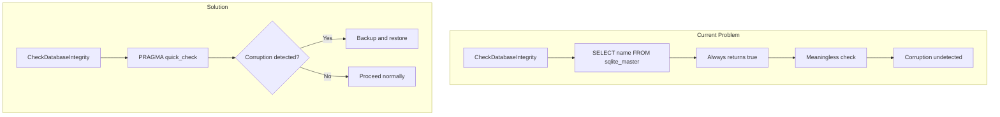
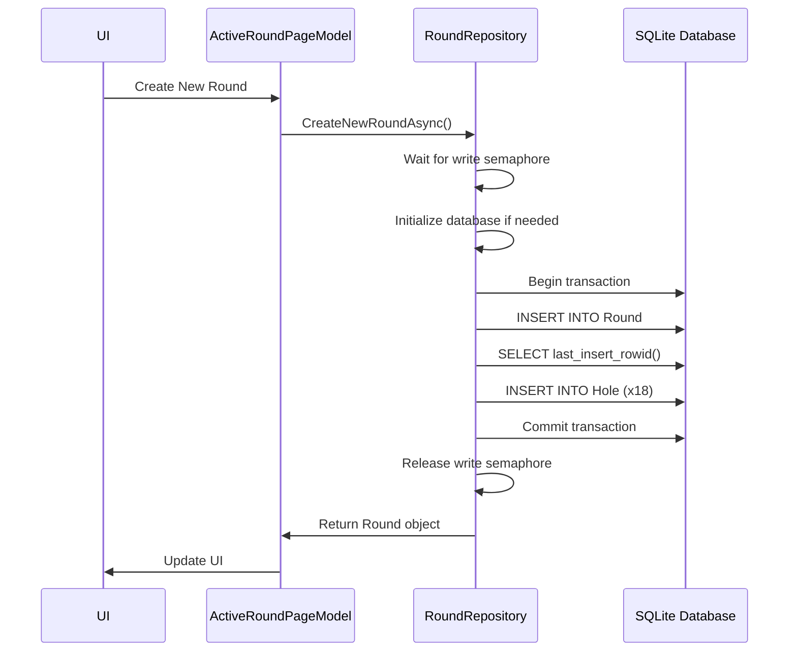
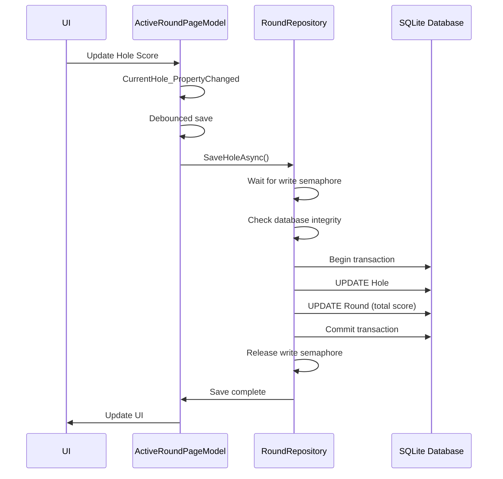
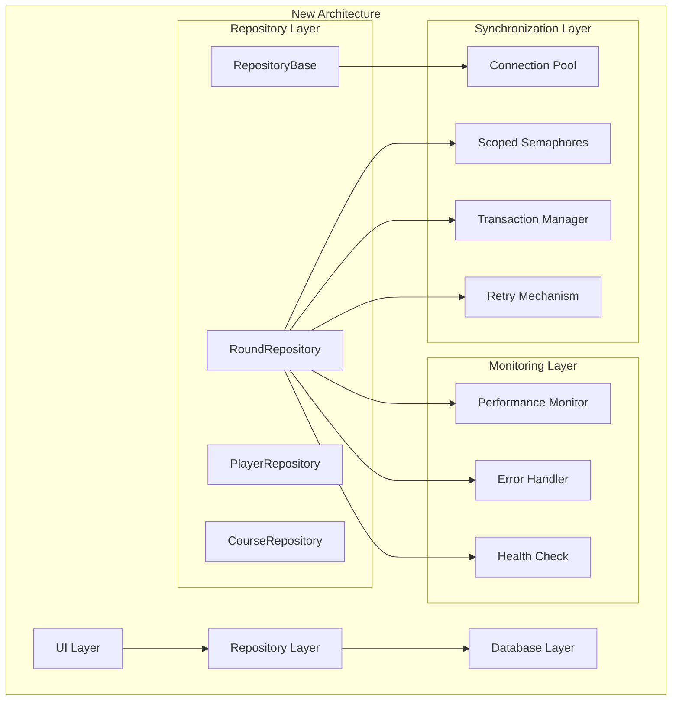

# Database Architecture and Issues Diagram

## System Architecture Overview



## Identified Issues and Impact

### 1. Race Condition in Repository Initialization

```mermaid
graph LR
    subgraph "Current Problem"
        A[Thread 1] --> B[Check _hasBeenInitialized]
        C[Thread 2] --> B
        B --> D[Both pass check]
        D --> E[Both enter Init()]
        E --> F[Race condition]
        F --> G[Duplicate initialization]
    end
    
    subgraph "Solution"
        H[Thread 1] --> I[Semaphore Wait]
        C --> I
        I --> J[Check _hasBeenInitialized]
        J --> K{Already initialized?}
        K -->|Yes| L[Return]
        K -->|No| M[Initialize]
        M --> N[Set _hasBeenInitialized]
        N --> O[Release Semaphore]
    end
```

### 2. Write Semaphore Contention



### 3. Auto-save Race Condition



### 4. Database Integrity Check Issues



## Data Flow Analysis

### Round Creation Flow



### Hole Update Flow



## Concurrency Issues Timeline

```mermaid
gantt
    title Concurrency Issues Timeline
    dateFormat  X
    axisFormat  %s
    
    section Critical Issues
    Race Condition in Init     :a1, 0, 4
    Write Semaphore Contention :a2, 2, 6
    Auto-save Race Condition   :a3, 1, 5
    
    section Performance Issues
    Connection Management     :a4, 3, 7
    Transaction Scope         :a5, 4, 8
    
    section Reliability Issues
    Database Integrity Check  :a6, 5, 9
    Error Handling            :a7, 6, 10
```



## Recommended Architecture Changes



This diagram illustrates the recommended architecture changes to address the identified timing, race condition, and stability issues in the current implementation.